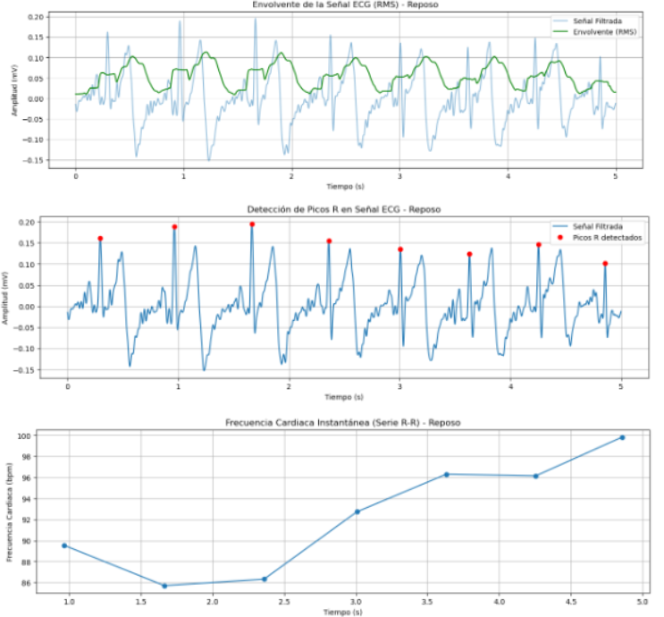
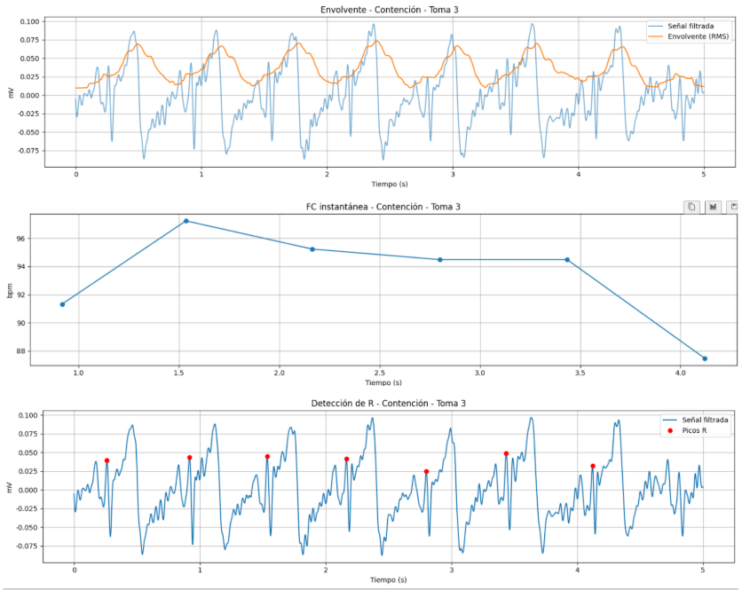
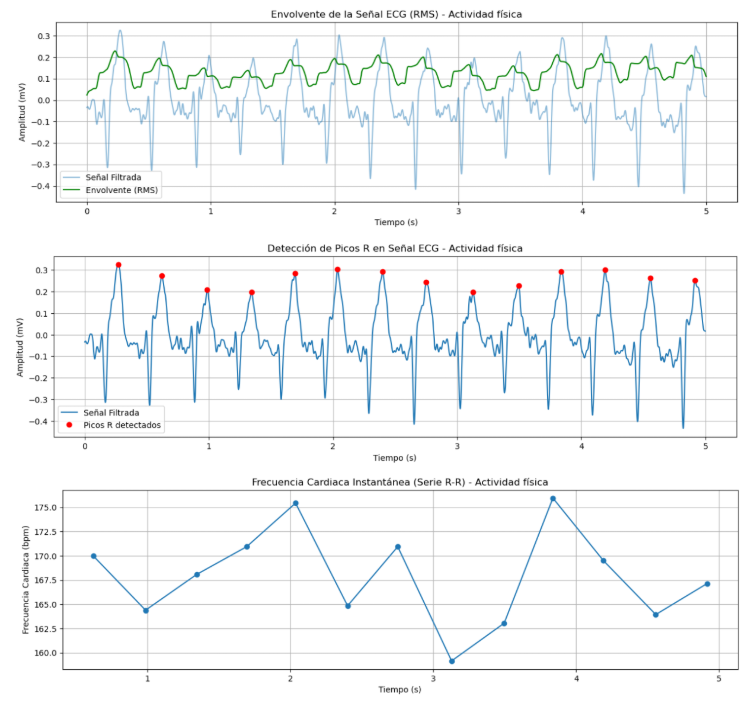
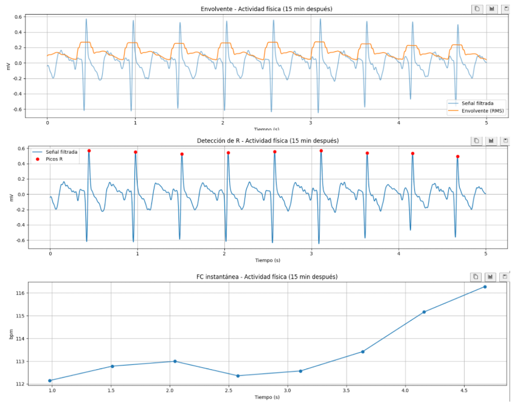

## :wave:Adquisición de señales ECG con BITalino
### :date:Tabla de contenidos

  - [1. Introducción](#page_facing_up1-introducción)
  - [2. Objetivos](#pushpin2-objetivos)
  - [3. Materiales](#pencil23-materiales)
  - [4. Procedimiento](#clipboard4-procedimiento)
    - [4.1. Conexión BITalino](#41-conexión-bitalino)
    - [4.2. Configuración OpenSignals](#42-configuración-opensignals)
    - [4.3. Colocación de electrodos](#43-colocación-de-electrodos)
    - [4.4. Video de tomas y ploteo de OpenSignals](#44-video-de-tomas-y-ploteo-de-opensignals)
  - [5. Resultados](#bookmark_tabs5-resultados)
    - [5.1. Posición - Muñeca](#51-posición---muñeca)
  - [Referencias](#notebookreferencias)
  - [Participación](#raised_handparticipación)
  
### :page_facing_up:1. Introducción

El músculo cardíaco genera la contracción del corazón y, con ello, la acción de bombeo. El mecanismo detrás de cada contracción involucra al músculo cardíaco y a los impulsos eléctricos. 
Estos impulsos son la base de la señal registrada mediante electrocardiograma (ECG) [1].

El electrocardiograma (ECG) es empleado para registrar la actividad eléctrica cardíaca. El análisis de sus diferentes ondas permite identificar diversas alteraciones: la onda P corresponde a la despolarización auricular, el complejo QRS refleja la despolarización de los ventrículos y la onda T representa la repolarización ventricular. Cambios en estas ondas pueden señalar distintas afecciones cardíacas; por ejemplo, un complejo QRS de mayor duración a la normalidad puede sugerir un engrosamiento ventricular, característico de patologías como la hipertrofia ventricular [2].

Es así que el ECG es importante en la práctica clínica, ya que permite detectar y evaluar arritmias, enfermedades cardíacas, infartos de miocardio y otras condiciones en las que se sospechan alteraciones en la actividad eléctrica cardíaca. [3]. 

En este escenario, se vuelve necesario disponer de herramientas que posibiliten el registro, procesamiento y análisis de señales de ECG de forma práctica y confiable. Una alternativa que responde a esta necesidad es BITalino, un sistema económico y de código abierto diseñado para la adquisición de bioseñales. Este equipo integra sensores modulares y un software propio (OpenSignals), lo que permite medir señales como ECG, EMG, EEG, EDA, entre otras, resultando útil para contextos educativos y de laboratorio.[4].

En este informe se hace uso del hardware BITalino, en conjunto con su kit de herramientas y software OpenSignals, para registrar las señales ECG de un compañero de laboratorio, con el propósito de analizar e identificar los patrones eléctricos vinculados a la contracción cardíaca.

### :pushpin:2. Objetivos
- **Objetivo general:**
  

  Adquirir, registrar y analizar señales biomédicas de electrocardiografía (ECG)  mediante el uso del módulo BITalino y el software OpenSignals, con el fin de comprender los principios de adquisición de bioseñales y su procesamiento básico en aplicaciones clínicas y tecnológicas.
</space>

- **Objetivos específicos:**
    
  - 
Registrar señales biomédicas de electrocardiografía (ECG) empleando el módulo BITalino.
  - 
Configurar el dispositivo BITalino y establecer su conexión con el software OpenSignals (r)evolution para garantizar una adquisición correcta de datos
  - 
Obtener y exportar la información de las señales ECG desde el software, con el propósito de realizar su procesamiento y análisis posterior.

### :pencil2:3. Materiales
- **Hardware:**

    | Nombre | Cantidad | Descripción | Ilustración |
    |--------|----------|-------------|-------------|
    | **Laptop** | 1 | Computador portátil y compacto que integra pantalla, teclado y batería, sistema operativo de 64 bits. |  |
    | **BITalino** | 1 | Dispositivo modular de adquisición biomédica que registra señales fisiológicas mediante electrodos de superficie. |  |
    | **Electrodos** | 3 | Sensores circulares de un solo uso con adhesivo y gel conductor, ideales para captar señales bioeléctricas (ECG, EMG, EEG). |  |
    | **Cable** | 1 | Cable de 3 electrodos Ag/AgCl. Accesorio que facilita la captura y transmisión de las señales con baja interferencia. |  |
    | **Batería** | 1 | Batería de litio recargable de 3.7 V. Fuente de energía, usada para alimentar el BITalino. |  |

Tabla 1: Hardware [5, 6, 7]

- **Software:**

    | Nombre | Cantidad | Descripción | Ilustración |
    |--------|----------|-------------|-------------|
    | **OpenSignals** | 1 | Software oficial de BITalino para la adquisición y visualización en tiempo real de las señales fisiológicas. |  |
    | **Python** | 1 | Lenguaje de programación con múltiples librerías en ciencia de datos y procesamiento de señales. |  |

Tabla 2: Software [8, 9]

### :clipboard:4. Metodología
#### 4.1. Conexión BITalino

Primero se alimenta el dispositivo BITalino con la bateria de litio de 3.7 V.

 GIF "Bateria"

Figura 1: Alimentación BITalino [Elaboración propia]

Luego, se utilizó el canal ECG (A2) de la placa Bitalino 71-01, conectando el cable con 3 electrodos Ag/AgCl circulares como se muestra a continuación.

 GIF "Canal"

Figura 2: Conexión ECG BITalino [Elaboración propia]

#### 4.2. Configuración OpenSignals
Se ingresa al software OpenSignals (r)evolution.

 GIF "Inicio"

Figura 3: Ingresando a OpenSignals [Elaboración propia]

Abrimos el administrador de dispositivos de Opensignals (r)evolution para acceder y configurar nuestro BITalino.

 GIF "Verde"

Figura 4: Administrador de dispositivos [Elaboración propia]

Seleccionamos el BITalino haciendo clic en el botón ENABLED. El dispositivo estara activado si el botón ENABLED está en azul.

 GIF "Enabled"

Figura 5: Activando el BITalino [Elaboración propia]

Hacemos clic en el logotipo de BITalino para acceder a su configuración. En el menú desplegable seleccionamos solo el canal ECG y deseleccionamos todos los demás. Además, configuramos su frecuencia de muestreo en 1000 Hz.

 GIF "Confi"

Figura 6: Configurando el BITalino [Elaboración propia]

Activamos el canal de adquisición haciendo clic en el círculo rojo (grabar).

 GIF "Grabar"

Figura 7: Adquisición de la señal [Elaboración propia]

#### 4.3. Colocación de electrodos

El siguiente procedimiento consiste en colocar los electrodos ECG en el usuario. Para ello se utilizó Where should I place my Electrocardiography (ECG) electrodes? - Home Knowlegde Base BITalino [10].
Primero, retiramos la lámina protectora del electrodo antes de colocarlo en la piel.

 GIF "Despegar"

Figura 8: Retiro de lámina protectora [Elaboración propia]

Colocamos el electrodo de referencia (tierra) en la cresta ilíaca.

 GIF "Tierra"

Figura 9: Electrodo de referencia [Elaboración propia]

Por último, colocamos los electrodos activos sobre las muñecas.

 GIF "Activos"

Figura 10: Electrodos activos [Elaboración propia]

#### 4.4. Video de tomas y ploteo de OpenSignals
- Posición - Muñecas:
  Esta posición se mide desde RA (-) hasta LL (+). Teniendo la conexión de tierra en la cresta ilíaca. 
  Se tomaron las siguientes señales:
  - En reposo: 1 repetición
  - Conteniendo el aire: por 30 segundos con un descanso de 1 minuto cada repetición, tuvo 3 tomas para reducir el error.
  - Después de realizar actividad física: por 5 minutos, ejercicio aeróbico, solo tuvo una toma ya que requería más tiempo y el cansancio del usuario disminuiría en cada toma. 
  - Post-ejercicio: reposo despues de mantener la respiración.
  
  | En reposo | Manteniendo la respiración | Actividad física | Post - ejercicio |
  |-----------|----------------------------|------------------|------------------|
  | Video "Reposo"| Video "MR"|  Video "AF"|  Video "PE" |

Tabla 3: Videos de la posición muñeca [Elaboración propia]

### :bookmark_tabs:5. Resultados

El script carga los archivos de texto con las muestras crudas de ECG obtenidas en el laboratorio y convierte canal analógico del BITalino a milivoltios. 

 mV = (ADC1024 - 0.5)*3.3v *1000 mV/V1100

Donde 1024 es la resolución de 10 bits, 0.5 ayuda a centrar la señal alrededor de 0 V(funciona como offset), 3.3 V es el voltaje de referencia y 1100 es la ganancia analogica del modulo ECG de BITalino(ganancia, rango 1 .5 mV, banda 0.5 - 40 Hz), tal como especifica el fabricante [11]. Se trabaja con fs=1000 Hz (valor apropiado para ECG de superficie).

En el preprocesado se aplica un filtro pasa banda de cuarto orden 0.5-40 Hz y luego un notch de 60Hz para eliminar la derivada de línea base, atenuar el ruido  de alta frecuencia y suprimir la interferencia de red preservando la morfología QRS [12, 13].

Se calcula la envolvente de la señal mediante RMS sobre ventanas  de 150 ms para resaltar los  latidos. El RSM suaviza la señal y destaca la energía de cada completo, lo que facilita la identificación automática incluso en condiciones de ruido [14]. 

Por otro lado, la detección de picos R se realiza con algoritmo de búsqueda de máximos, aplicando un umbral de altura relativa y un periodo  refractario mínimo, siguiendo la lógica de métodos clásicos como Pn- Tompkins [15]. A partir de esos intervalos entre picos R se calcula la frecuencia cardiaca instantánea entre latidos por minuto (FCI= 60/RR), lo que permite analizar el dinamismo del ritmo latido a latido.

- 
Envolvente RMS → muestra la energía y periodicidad de los latidos, útil para validar la estabilidad de la señal.
- 
Señal ECG con picos R detectados → confirma la calidad de adquisición, amplitud y regularidad del ritmo.
- 
Frecuencia cardiaca instantánea (serie R–R) → permite visualizar cómo varía la frecuencia cardiaca latido a latido, aportando información más rica que un promedio.

#### 5.1. Posición - Muñeca
- **Reposo:**
  !
  
Figura 11: Señales ECG medida de la muñeca cuando se esta en reposo: envolvente, detección de picos R y frecuencia cardiaca. [Elaboración propia]

  

  La señal ECG en reposo presenta complejos QRS claramente definido con una amplitud aproximada de 0.15 - 0.20mV, mientras que la señal completa tiene una amplitud de qué ronda desde -0.15mv a 0.20 mV, ambos valores(tanto de la señal completa como el complejo QRS)  se encuentran dentro del  rango esperado en registros de superficie con sensores portátiles como BITalino(-1.5 a 1.5 mV) [11]. Las ondas P y T se diferencian con menor amplitud (0.05 - 0.13 mV), lo que concuerda con la fisiología del ECG, donde el complejo QRS presenta la mayor parte de la actividad eléctrica.
  
A partir del análisis de intervalos R-R (Figura 1a), la frecuencia cardiaca instantánea oscila entre 86 y 100 latidos por minuto, lo que corresponde al intervalo de valores reportado en la literatura [16]. En cuanto a la información obtenida por la gráfica envolvente(Figura 1c), se confirma que los latidos se presentan de manera regular y estables, sin artefactos que generen un distorsión significativa en el registro de la señal. 
  
En términos fisiológicos, los hallazgos corresponden a un ritmo sinusal normal, que se caracteriza por la presencia de ondas P, complejo QRS y ondas T organizadas en cada ciclo. Por otro lado, las ligeras variabilidades observadas en la frecuencia cardiaca instantánea (aumento de 86 a 100 lpm) es esperable en el reposo y se asocia a la influencia de la respiración sobre el ritmo cardiaco, fenómeno conocido como arritmia sinusal respiratoria, que es un mercado de un correcta modulación autonómica y es asociado a una función cardiovascular saludable [17]. 

- **Manteniendo la respiración:**
  - Conteniendo la respiración:
  !
  
Figura 12: Señales ECG de la muñeca cuando se contiene la respiración: envolvente, FC y detección de R. [Elaboración propia]

  

  Durante la contención de las respiración de la toma 3, la señal EMG filtrada muestra amplitudes relativamente bajas rondando +- 0.075 mV, la envolvente estable resulta los complejos QRS y permite observar la dinámica de la señal de manera clara. Además, la detección de los pico R indica una frecuencia cardiaca mantenida entre 88 y 97 latidos por minuto, con algunas fluctuaciones pero sin un tendencia de creer muy pronunciada como la que se observa en la fase de recuperación. Esta estabilidad refleja  una gran influencia de la maniobra de panea, que genera un mayor visualización de la modulación vagal y tendencia a producir una relativa bradicardia o atenuación de la variabilidad [17, 18]. En la gráfica de la frecuencia cardiaca instantánea se puede confirmar esta interpretación ya que , aunque hay variaciones puntuales, la curva se mantiene dentro del rango reducido, mostrando la acción del sistema parasimpático sobre el nodo sinusal en condiciones de apnea voluntaria [18, 19]. Lo reportado en la literatura indica que la contención de la respiración produce una reducción transitoria en el retorno venoso y modificaciones de la presión intratorácica, lo que activa reflejos cardiovasculares que se interpretan como una frecuencia cardiaca contenida y con menor dispersión [17, 20]. 

  - Tras contener la respiración:
  
  
Figura 13: Señales ECG de la muñeca tras contención de la respiración: envolvente, FC y detección de R. [Elaboración propia]

  

  En la Toma 3 en la fase de recuperación tras la contención de respiración, la señal ECG filtrada muestras amplitudes alrededor de +- 0.2mV y  en la volvente RSM se nota estable, lo cual indica que existe una buena delimitación de los complejos QRS y una progresiva regularización de la actividad eléctrica cardiaca tras la apnea. La detección de los picos R evidencia que los intervalos R-R se reducen gradualmente, lo que refleja un aumento de la frecuencia cardiaca a los largo de los primeros segundos de recuperación. Esto se corrobora con la curva de la frecuencia cardiaca instantánea, que asciende de 75 a 100 latidos por minuto en un lapso de 3 a 4 segundos. Este comportamiento corresponde al fenomenos fisiológico que se describe en la literatura: durante la contención de la respiración suele observarse que una tendencia a la bradicardia transitoria, lugo un taquicardia compensatoria al redundar la ventilación, medida por la activación simpática y os cambio hemodinámicos intratoracicos [18, 20]. Por otro lado, la respuesta refleja la modulación autonómica en episodio de hipoxia intermitente y apnea, donde se produce overshoot de la frecuencia cardiaca durante la fase de recuperación en el sistema simpático[19, 21]. Entonces, la toma 3 se tomó como la representación más clara de este ciclo fisiológico porque muestran un señal más limpia, una detección robusta de los pico R y un patrón de variación de frecuencia cardiaca que coincide con otros reportes experimentales [17, 21]

- **Actividad física:**
  !
  
Figura 14: Señales ECG de la muñeca cuando se reliza actividad física: envolvente, detección de picos R y frecuencia cardiaca. [Elaboración propia]

  

  En la actividad física inmediata, señal ECG presentan un mayor amplitud  comparación de las fases de reposo o contención, con una envolvente en RMS mas marcas y estable, lo que sugiere una intensificación en la activa eléctrica ventricular asociada al incremento del gasto cardiaco.  Asimismo, se observa un acortamiento en los intervalos R-R característicos del ejercicio. La serie temporal de frecuencia cardiaca instantánea muestra valores elevados y variables entre 160 y 10 latidos por minuto, con oscilaciones rápidas que coinciden con la activación simpática y modulación aerodinámica durante el ejercicio físico. En la literatura, el ejercicio genera una respuesta cronotrópica positiva mediada por el sistema nervioso simpático, con liberación de catecolaminas  y aumento de la conducción nodal,  lo que acelera la frecuencia cardiaca y la potencia contráctil del corazón [18 ,22].  Estos resultados coinciden con lo que se ha reportado en estudios que describen cómo la frecuencia cardíaca durante ejercicio refleja no solo la intensidad del esfuerzo, sino también la capacidad adaptativa del sujeto para responder a las demandas metabólicas [22, 23].

- **Post - ejercicio:**
  !
  
Figura 15: Señales ECG de la muñeca post - actividad física: envolvente, detección de picos R y frecuencia cardiaca. [Elaboración propia]

  

  Luego de 15 minutos de actividad física, en la recuperación, la señal ECG muestra un cambio en el esfuerzo inmediato, donde la amplitud de los complejos QRS aumentaban hasta +- 0.6 mV, mientras que la refuencan cariada instantánea desciende hacía un rango de 112-116 latidos por minuto, mucho mejor a los observados en el ejercicio inmediación donde fue de 160 bpm. La señal envolvente revela una señal más regular, con menor dispersión y una dinámica más estable, lo que indica que el sistema nervioso autónomo se está restableciendo el equilibrio entre la modulación simpática y parasimpática. Lo que se obtuvo en el laboratorio condice con lo que reporta la literatura sobre la recuperación post-ejercicio, donde se describe una disminución progresiva de la frecuencia cardiaca tras la interrupción del ejercicio(esfuerzo), lo que se conoce como “heart rate recovery”, que depende la reactivación vagal y la suspensión gradual de la descarga simpática [22, 24]. La magnitud y la velocidad de esta caída en la frecuencia cardiaca se consideran marcadores de condición física y de pronóstico cardiovascular [23, 24]. En este caso, la redcoon observada luego de 15 minutos evidencia una respuesta fisiológica adecuada y consistente con estudios que señalan que aunque la frecuencia cardiaca no retorna de inmediato a valores basales(reposo), si se acerca al rango de reposo gracias al procedimiento el sistema parasimpático y la normalización hemodinámica[22, 24] .

### :bookmark_tabs:6. Conclusiones

El procesamiento de señales ECG obtenidas con el sistema BITalino prometió validar la correcta conversión de los datos analogicos a unidades milivoltios y la eficacia del preprocesado mediana filtro pasa-banda (0.5–40 Hz) y notch de 60 Hz para preservar la morfología del complejo QRS eliminando ruido de red y deriva de línea base. El cálculo de la envolvente RMS y la detección automática de picos R mostraron herramientas robustas para la caracterización de los intervalos R-R y el análisis de la frecuencia cardiaca instantánea, coincidiendo con metodologías descritas en la literatura reciente [11-14]. 

En condiciones de reposo, los resultados que se obtuvieron evidencian un ritmo sinusal normal con variabilidad fisiológica que se atribuye a la modulación vagal respiratoria, lo que coincide con la arritmia sinusal respiratoria descrita en estudios previos [15]. En la contención de las respiración, se reflejó una reducción relativa de la variabilidad y una frecuencia cardiaca estable en un rango reducido, lo que sugiere el predominio del tono parasimpático y la activación de reflejos cardiovasculares que se asocian a la apnea voluntaria [16, 17]. En cuanto, a la fase de recuperación posterior a la contención, la frecuencia mostró un ascenso rápido desde valores cercanos a bradicardia hacia un rango de taquicardia compensatoria, lo que refleja la activación simpática y la nueva adaptación hemodinámica cuando se restablece la ventilación [17, 18]. 

En la activación física inmediata, se registró un incremento marcado de la amplitud de los complejos QRS y en la frecuencia cardiaca, alcanzando valores cercano a 160 latidos por minuto, lo que coincide con la respuesta cronotrópica positiva inducido por la estimulación simpática y a liberación de hormonas y neurotransmisores (catecolaminas) durante el ejercicio [19, 20]. Luego, en la recuperación tras 15 minutos, la FC descendió pausadamente  hacia valores de 112-116 lpm, eso se debe al restablecimiento gradual del equilibrio simpático- parasimpático y la importanci clínica del fenómeno “heart rate recovery” como marcador de condición física y pronóstico cardiovascular [20, 21]. 

Resumiendo, los hallazgos obtenidos validan el procesamiento digital de señales ECG con el sistema BITalino; sin embargo, también reflejan fenómenos fisiológicos ampliamente descritos en la literatura, demostrando la coherencia entre la teoría y lo obtenido en de forma experimental. Esto realza la utilidad de este tipo de prácticas para la comprensión de la modulación autonómica cardíaca en distintos estados fisiológicos y su potencial aplicación en estudios de variabilidad cardiaca.

### :notebook:Referencias

[1] R. Ripa, T. George, K. R. Shumway, and Y. Sattar, “Physiology, cardiac muscle,” StatPearls - NCBI Bookshelf, Jul. 30, 2023. https://www.ncbi.nlm.nih.gov/books/NBK572070

[2] Y. Sattar and L. Chhabra, “Electrocardiogram,” StatPearls - NCBI Bookshelf, Jun. 05, 2023. https://www.ncbi.nlm.nih.gov/books/NBK549803/

[3] K. B. Hudson, A. Sudhir, G. F. Glass, and W. Brady, The electrocardiogram in emergency and acute care. Wiley-Blackwell, 2022.

[4] R. E. Wagner, H. P. Da Silva, and K. Gramann, “Validation of a Low-Cost Electrocardiography (ECG) system for psychophysiological research,” Sensors, vol. 21, no. 13, p. 4485, Jun. 2021, doi: 10.3390/s21134485.

[5] “BITalino”. PLUX Biosignals. Accedido el 07 de setiembre de 2025. [En línea]. Disponible: https://www.pluxbiosignals.com/collections/bitalino?srsltid=AfmBOoqBigYX8r0j9zwN0ihDuDh8aKeExNMqrqEBD33tRp62ois9JYyd

[6] “CABLE PARA 3 ELECTRODOS – EMG/ECG – SAI SAC – MECATRONICA.”. Sisac Mecatronica. Accedido el 07 de setiembre de 2025. [En línea] https://mecatronica.saisac.pe/producto/cable-para-3-electrodos-emg-ecg-2

[7] “Batería de litio 3.7 V”. Engitronic. Accedido el 07 de setiembre de 2025. [En línea] https://www.engitronicperu.com/producto/bateria-de-litio-3-7-v

[8] “Insights that connect you to success | Opensignal”. Insights that connect you to success | Opensignal. Accedido el 26 de agosto de 2025. [En línea]. Disponible: https://www.opensignal.com/

[9] “Welcome to Python.org”. Python.org. Accedido el 26 de agosto de 2025. [En línea]. Disponible: https://www.python.org/

[10] “Where should I place my Electrocardiography (ECG) electrodes?”. BITalino. Accedido el 10 de setiembre de 2025. [En línea]. Disponible: https://support.pluxbiosignals.com/knowledge-base/where-should-i-place-my-electrocardiocraphy-ecg-electrodes

[11] PLUX – Wireless Biosignals, S.A., Electrocardiography (ECG) Sensor Data Sheet, Rev. B, Lisbon, Portugal, 2020. [Online]. Available: http://bitalino.com/

[12] F. Buendía-Fuentes, M. A. Arnau-Vives, A. Arnau-Vives, Y. Jiménez-Jiménez, J. Rueda-Soriano, E. Zorio-Grima, A. Osa-Sáez, L. V. Martínez-Dolz, L. Almenar-Bonet, and M. A. Palencia-Pérez, “High-Bandpass Filters in Electrocardiography: Source of Error in the Interpretation of the ST Segment,” ISRN Cardiology, vol. 2012, Article ID 706217, Jun. 2012, doi: 10.5402/2012/706217.

[13] GE HealthCare, “A Guide to ECG Signal Filtering,” GE HealthCare Insights, Aug. 2, 2023. [Online]. Available: https://www.gehealthcare.com/insights/article/a-guide-to-ecg-signal-filtering

[14] F. Esgalhado, A. Neves, J. P. Silva, and H. Gamboa, “Peak detection and HRV feature evaluation on ECG and PPG signals,” Symmetry, vol. 14, no. 6, p. 1139, Jun. 2022, doi: 10.3390/sym14061139.

[15] J. Pan and W. J. Tompkins, “A Real-Time QRS Detection Algorithm,” IEEE Transactions on Biomedical Engineering, vol. BME-32, no. 3, pp. 230–236, Mar. 1985, doi: 10.1109/TBME.1985.325532.

[16] American Heart Association, “All About Heart Rate (Pulse),” AHA, 2022. [Online]. Available: https://www.heart.org/en/healthy-living/fitness/fitness-basics/target-heart-rates

[17] F. Shaffer and J. P. Ginsberg, “An overview of heart rate variability metrics and norms,” Frontiers in Public Health, vol. 5, p. 258, Sep. 2017, doi: 10.3389/fpubh.2017.00258.

[18] Y. Amekran and A. J. El Hangouche, “Effects of exercise training on heart rate variability in healthy adults: A systematic review and meta-analysis of randomized controlled trials,” Cureus, vol. 16, no. 6, p. e62465, Jun. 2024, doi: 10.7759/cureus.62465.

[19] C. S. Hansen, M. M. B. Christensen, D. Vistisen, R. Jepsen, C. Ellervik, M. E. Jørgensen, and J. Fleischer, “Normative data on measures of cardiovascular autonomic neuropathy and the effect of pretest conditions in a large Danish non-diabetic CVD-free population from the Lolland-Falster Health Study,” Clinical Autonomic Research, vol. 35, pp. 101–113, Oct. 2024, doi: 10.1007/s10286-024-01069-6.

[20] A. Sundas, I. Contreras, J. Navarro-Otano, J. Soler, A. Beneyto, and J. Vehi, “Heart rate variability over the decades: a scoping review,” PeerJ, vol. 13, p. e19347, 2025, doi: 10.7717/peerj.19347.

[21] C. Besson, A. L. Baggish, P. Monteventi, L. Schmitt, F. Stucky, and V. Gremeaux, “Assessing the clinical reliability of short-term heart rate variability: insights from controlled dual-environment and dual-position measurements,” Scientific Reports, vol. 15, no. 1, p. 5611, Feb. 2025, doi: 10.1038/s41598-025-89892-3.

[22] R. Su, P. Peng, W. Zhang, J. Huang, J. Fan, D. Zhang, J. He, H. Ma, and H. Li, “Dose-effect of exercise intervention on heart rate variability of acclimatized young male lowlanders at 3,680 m,” Frontiers in Physiology, vol. 15, p. 1331693, Mar. 2024, doi: 10.3389/fphys.2024.1331693.

[23] A. E. Aubert, B. Seps, and F. Beckers, “Heart rate variability in athletes,” Sports Medicine, vol. 33, no. 12, pp. 889–919, 2003, doi: 10.2165/00007256-200333120-00003.

[24] C. R. Cole, E. H. Blackstone, F. J. Pashkow, C. E. Snader, and M. S. Lauer, “Heart-rate recovery immediately after exercise as a predictor of mortality,” New England Journal of Medicine, vol. 341, no. 18, pp. 1351–1357, Oct. 1999, doi: 10.1056/NEJM199910283411804.

### :raised_hand:Participación
- Eduardo Poma: 33.33%
- Rodrigo Gorbeña: 33.33%
- Jennifer Cancino: 33.33%