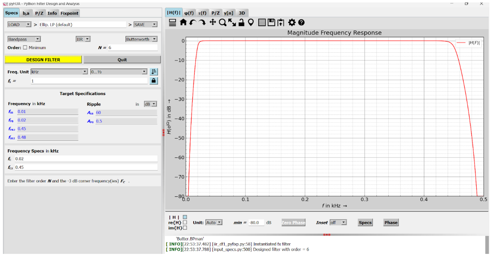
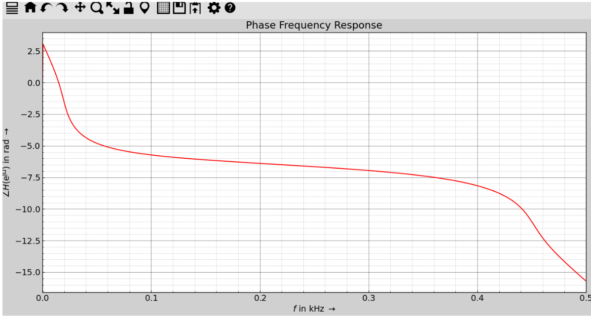
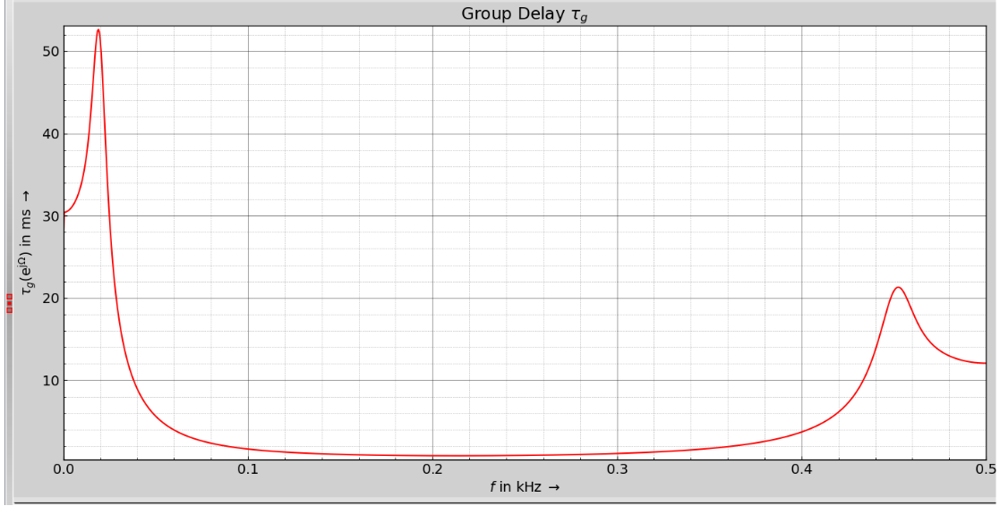
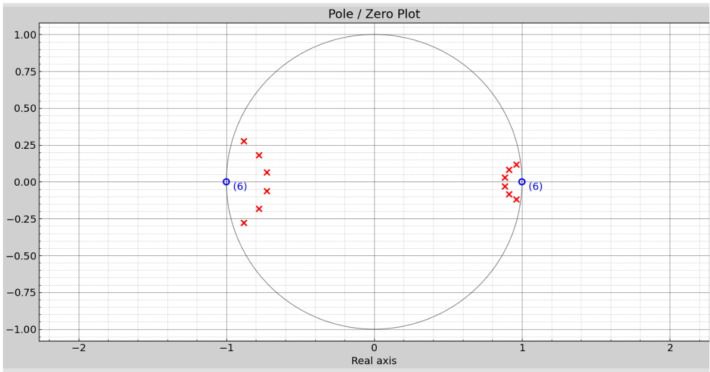
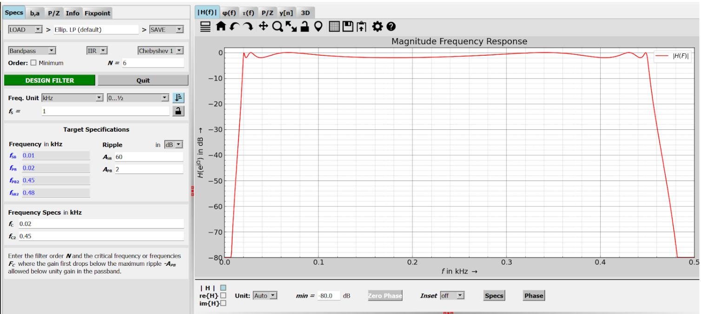
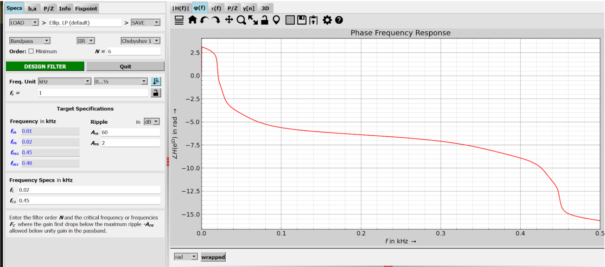
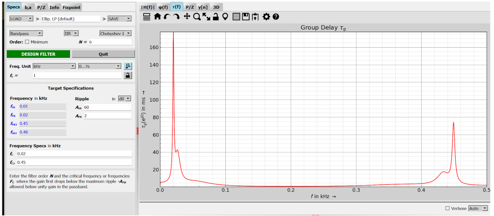
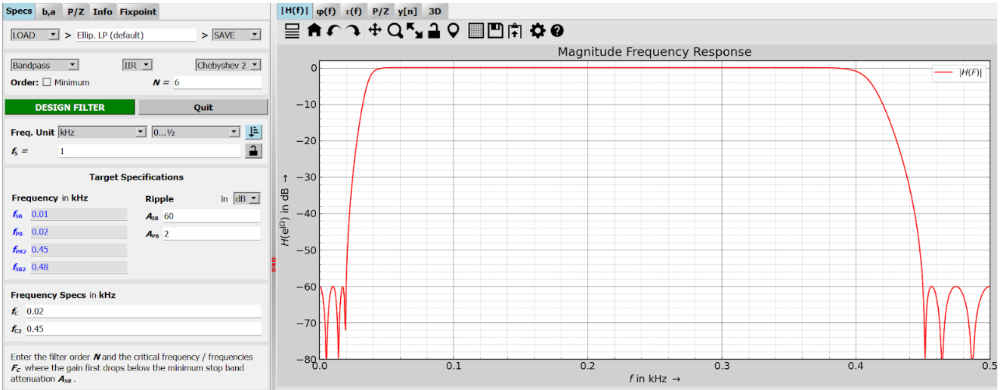
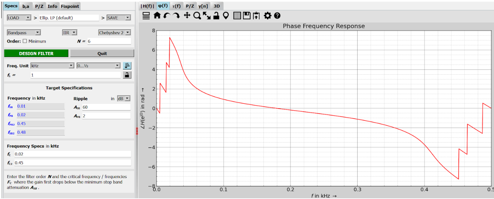
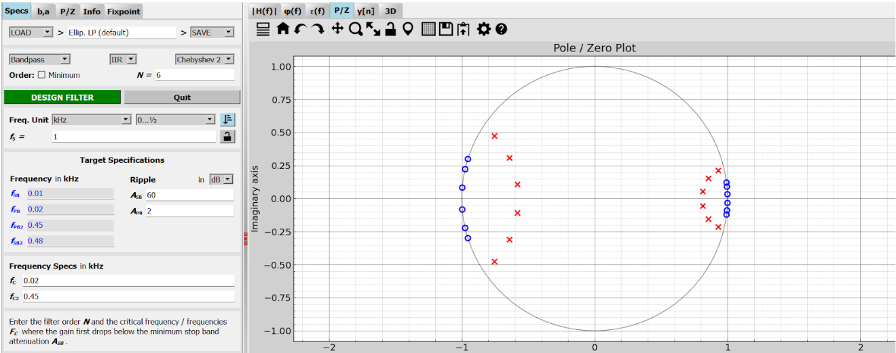

## Filtros Digitales
### :date:Tabla de contenidos

  - [1. Introducción](#page_facing_up1-introducción)
  - [2. Objetivos](#pushpin2-objetivos)
  - [3. Materiales](#pencil23-materiales)
  - [4. Metodología](#clipboard4-metodología)
    - [4.1. Configuración PYFDA para EMG](#41-configuración-pyfda-para-emg)
      - [4.1.1 Filtros pasabanda de 20-450 Hz](#411-filtros-pasabanda-de-20-450-hz)
      - [4.1.2 Filtros rechazabanda de 60 Hz](#412-filtros-rechazabanda-de-60-hz)
    - [4.2. Configuración PYFDA para ECG](#42-configuración-pyfda-para-ecg)
  - [5. Señales con filtros](#chart_with_upwards_trend5-señales-con-filtros)
    - [5.1. Señales EMG filtradas](#51-señales-emg-filtradas)
      - [5.1.1 Filtros pasabanda de 20-450 Hz](#511-filtros-pasabanda-de-20-450-hz)
      - [5.1.2 Filtros rechazabanda de 60 Hz](#512-filtros-rechazabanda-de-60-hz)
    - [5.2. Señales ECG filtradas](#52-señales-ecg-filtradas)
      - [5.2.1 Reposo](#521-reposo)
      - [5.2.2 Resta](#522-resta)
  - [6. Discusión](#bookmark_tabs6-discusión)
  - [7. Conclusiones](#memo7-conclusiones)
  - [Referencias](#notebookreferencias)
  - [Participación](#raised_handparticipación)
  
### :page_facing_up:1. Introducción

El electrocardiograma (ECG), electromiograma (EMG) y electroencefalograma (EEG), son herramientas fundamentales para el diagnóstico clínico e investigación biomédica. A través de su análisis se puede detectar alteraciones fisiológicas y apoyar la toma de decisiones médicas. Sin embargo al mismo tiempo, estas señales son altamente susceptibles a interferencias externas e internas que dificultan su interpretación.

El ECG, por ejemplo, es sensible a la interferencia de línea eléctrica (50/60 Hz), ruido muscular EMG y al movimiento del paciente; el EMG se ve afectado por el ruido inherente cuando el musculo no esta contraido, señales musculares superpuestas y ruido del ECG; mientras que el EEG presenta distorsiones derivadas de parpadeos, latidos del corazón o actividad muscular [1], [2], [3]. Todas estas interferencias opacan la señal de interés si es que no se aplican las técnicas de procesamiento digital necesarias.

El procesamiento digital de señales ofrece herramientas que permiten mejorar la calidad de estas. Entre ellas, los filtros digitales tienen la capacidad de eliminar ruido no deseado preservando las características fisiológicas. En particular, los filtros FIR (Finite Impulse Response) e IIR (Infinite Impulse Response) son los más utilizados: por su control en la respuesta en frecuencia, y por su eficiencia en aplicaciones en tiempo real respectivamente [4].

El diseño de estos filtros depende de las características de cada señal. El ECG presenta un rango de 0.05 a 100 Hz y requiere filtros pasa bajos, pasa altos y notch para suprimir interferencias específicas [5]. El EMG, en cambio, contiene información en un rango más amplio, entre 20 y 500 Hz, lo que hace necesario el uso de filtros pasa banda [6]. El EEG, por su parte, concentra sus componentes en frecuencias por debajo de 100 Hz, organizadas en bandas características (delta, theta, alfa, beta y gamma), lo que exige filtros que las preserven [7]. Para estos filtros, es común emplear técnicas como el método de ventanas o el algoritmo de Parks-McClellan en el caso de FIR, y transformaciones bilineales de funciones analógicas como Butterworth o Chebyshev para los IIR [4].

En este contexto, este laboratorio presenta el diseño e implementación de filtros digitales FIR e IIR. En particular, se analizaron y aplicaron los filtros a las señales EMG y ECG obtenidas de laboratorios previos, con el fin de evaluar su capacidad de mejora en la calidad de las señales.

### :pushpin:2. Objetivos
- **Objetivo general:**
  

  Analizar y aplicar técnicas de procesamiento digital, enfocadas en EMG y ECG, mediante el diseño de filtros digitales FIR e IIR, con el fin de mejorar la calidad de las señales y facilitar su interpretación.
</space>

- **Objetivos específicos:**
    
  - 
Revisar y comparar las técnicas de diseño de filtros digitales FIR e IIR.
  - 
Implementar los filtros en señales EMG y ECG, para evaluar su desempeño en la reducción de ruido sin pérdida de información fisiológica relevante.
  - 
Analizar los resultados de las señales EMG y ECG filtradas.

### :pencil2:3. Materiales
- **Hardware:**

    | Nombre | Cantidad | Descripción | Ilustración |
    |--------|----------|-------------|-------------|
    | **Laptop** | 1 | Computador portátil y compacto que integra pantalla, teclado y batería, sistema operativo de 64 bits. |  |
    

Tabla 1: Hardware

- **Software:**

    | Nombre | Descripción | Librerías | Ilustración |
    |--------|-------------|-----------|-------------|
    | **Python** | Lenguaje de programación con múltiples librerías en ciencia de datos y procesamiento de señales. | <ul><li>pyfda</li><li>neurokit2</li><li>matplotlib</li><li>scipy</li><li>numpy</li></ul> |  |

Tabla 2: Software [8]

### :clipboard:4. Metodología
#### 4.1. Configuración PYFDA para EMG
##### 4.1.1. Filtros pasabanda de 20-450 Hz

Para la adquisición de señales de electromiografía de superficie (sEMG) es fundamental eliminar componentes indeseados fuera del rango fisiológico útil. En el espectro de sEMG el rango fisiológico útil se encuentra entre 20 - 450 Hz, mientras que las bajas frecuencias (<20 Hz) corresponde a artefactos de movimiento y derivaciones de líneas base, y las altas frecuencias (>450) están dominadas por el ruido térmico e interferencia electromagnética [9].

Por ellos, se implementó filtros pasa-banda de 20 Hz - 450 Hz que permite mantener información neuromuscular relevante y descartar componentes no fisiológicos. Para el diseño se evaluaron tanto filtros IIR (Butterworth, Chebyshev I y Chebyshev II) como un filtro FIR basado en ventana de Hamming.

| Filtro | Parámetros | Respuesta de frecuencia | Retraso de grupo | Diagrama polos y ceros |
|--------|------------|-------------------------|------------------|------------------------|
| **Butterworth** |  |  |  |  |
| **Chebyshev 1** |  |  |  |  |
| **Chebyshev 2** |  |  |  |  |
| **Hamming** |  |  |  |  |

Tabla 3: Filtros para 20-450 Hz [Elaboración propia]

##### 4.1.2. Filtros rechazabanda de 60 Hz

En la adquisición de señal de superficie de electromiografía, el principal contaminante es la interferencia de la red eléctrica que se manifiesta a los 50 o 60 Hz, esto depende del sistema eléctrico del país. En el caso de latinoamérica y ortamería, la red operaria es a 60 Hz, lo que introduce un artefacto periodico que puede enmascarar la actividad muscular real ya detectar la interpretación de ciertos parámetros espectrales y temporales [10].

Para suprimir estas interferencias se implanta un filtro toche (bandstop) centrado de 60 Hz, el cual tenían específicamente esa frecuencia y sus alrededores sin alterar de manera significativamente la integridad de la señal neuromuscular, pero eliminando la componente del audio de la red eléctrica. 

| Filtro | Parámetros | Respuesta de frecuencia | Retraso de grupo | Diagrama polos y ceros |
|--------|------------|-------------------------|------------------|------------------------|
| **Butterworth** |  |  |  |  |
| **Chebyshev 1** |  |  |  |  |
| **Chebyshev 2** |  |  |  |  |
| **Hamming** |  |  |  |  |

Tabla 4: Filtros para 60 Hz [Elaboración propia]

#### 4.2. Configuración PYFDA para ECG
##### 4.2.1. Filtros para 0.5-40 Hz
| Filtro | Parámetros | Respuesta de frecuencia | Retraso de grupo | Diagrama polos y ceros |
|--------|------------|-------------------------|------------------|------------------------|
| **Butterworth** |  |  |  |  |
| **Chebyshev 1** |  |  |  |  |
| **Chebyshev 2** |  |  |  |  |
| **Hamming** |  |  |  |  |

Tabla 5: Filtros para 0.5-[40-50] Hz [Elaboración propia]

### :chart_with_upwards_trend:5. Señales con filtros
#### 5.1. Señales EMG filtradas
##### 5.1.1. Filtros pasabanda de 20-450 Hz
  
El filtro Butterworth IRR pasabanda 20-450Hz presenta una respuesta en magnitud plana en la banda de paso, lo que asegura que las frecuencias características de la señal EMG se conserven insultantes.  Sin embargo, la respuesta en fase no es lineal, lo que genera distorsión temporal de la señal, esto también se refleja en el retardo de grupo, que alcanza valores elevados en los bordes del espectro (50 ms) y menores en la banda central (5-10ms). En el diagrama de polos y ceros se muestra que todos los polos están dentro del círculo unitario y los ceros se ubican simétricamente en +/- 1, lo que confirma su estabilidad y define la selectividad en los extremos de la banda.

  

  
Figura 1: Filtro Butterworth IRR pasabanda de 20-450 Hz. [Elaboración propia]

  
  
El Chebyshev I pasabanda 20-450 Hz muestra en magnitud una banda pasante definida  con ondulaciones visibles a lo largo del paso y una caída muy pronunciada en los bordes. En la fase desciende de manera no lineal a medida que aumenta la frecuencia. El retardo de grupo presenta picos cerca de las frecuencias de corte, destacando uno en la zonas bajas y otro menor hacia el límite superior, sin embargo, en la zona central se mantienen reducidos. En el diagrama de polos y ceros, los polos parecen distribuidos al borde inferior del círculo unitario y los ceros están simétricos en el eje real. 

  

  
Figura 2: Filtro Chebyshev I pasabanda de 20-450 Hz. [Elaboración propia]

  
En Chebyshev II pasabanda 20–450 Hz muestra en magnitud una banda pasante plana y un rechazo muy selectivo fuera de banda, pero con ondulaciones en la banda de rechazo. La fase desciende de forma no lineal con cambios bruscos hacia los bordes del espectro. El retardo de grupo es bajo y estable en la zona central y presenta picos cercanos a las frecuencias de corte, indicando mayor retraso para componentes próximos a los límites. En el diagrama de polos y ceros, los ceros se ubican cerca del círculo unitario en las bandas rechazadas y los polos quedan dentro del círculo, confirmando estabilidad y la alta selectividad observada.

  

  
Figura 3: Filtro Chebyshev II pasabanda de 20-450 Hz. [Elaboración propia]

  
La magnitud del filtro FIR diseñado con ventana Hamming muestra un paso de banda limitado en rango de 20-450Hz, con una atenuación pronunciada en la banda de rechazo, Sin embargo, presentan lóbulos secundario, lo que reduce la capacidad de aenciancion fuera de la banda. En cuanto a la fase, se observa que presenta una respuesta lineal en todo el espectro, esto asegura que no se produzca una distorsión de fase y que la morfología de la onda EMG se conserve. El retardo en el grupo se mantiene constante(confirma el comportamiento lineal de la fase), pero implica una latencia fija alta. Por último, el diagrama de polos y ceros muestra únicamente ceros distribuidos sobre la superficie unitaria y polos en el origen, lo cual es propio de los filtros FIR y garantiza estabilidad y fase lineal a costa de un mayor orden (N=400).

  

  
Figura 4: Filtro Hamming FIR pasabanda de 20-450 Hz. [Elaboración propia]

##### 5.1.2. Filtros rechazabanda de 60 Hz:
  
El filtro bandstop (notch) a 60 Hz Butterworth muestra en magnitud una muesca muy estrecha centrada en 60Hz con fuerte atenuación , manteniendo la ganancia prácticamente inalterada en el respeto del espectro. La fase presenta cambios abruptos únicamente en las cercanías de la muesca, mientras que fuera de esa región se comporta de forma estable. El retardo del grupo parece mostrar un pico pronunciado alrededor de 60Hz y valores reducido en el resto de frecuencias. En el diagrama polo y cero se observan ceros sobre el círculo unitario en ±60 Hz, acompañados de polos próximos en el interior, esto define la profundidad y el ancho de la muesca y garantiza la estabilidad del filtro.

  

  
Figura 5: Filtro Butterworth IRR rechazabanda de 60 Hz. [Elaboración propia]

  
  
El filtro Chebyshev tipo I diseñado en configuración notch (60 Hz) muestra una atenuación selectiva y profunda en la frecuencia central de 60 Hz, preservando la ganancia en las demás bandas del espectro. La respuesta en magnitud evidencia una caída abrupta en torno a la frecuencia de rechazo,mientras que la fase presenta un comportamiento no lineal, con cambios bruscos en las cercanías del notch. La gráfica de retardo de grupo confirma este fenómeno al mostrar un pico pronunciado alrededor de 60 Hz, lo que indica distorsión temporal localizada en la banda de rechazo. En el plano polos/ceros se observan pares de ceros ubicados sobre el círculo unitario en la región correspondiente a 60 Hz. 

  

  
Figura 6: Filtro Chebyshev I rechazabanda de 60 Hz. [Elaboración propia]

  
En el caso de Chebyshev II, la respuesta en magnitud muestra un rechazo muy pronunciado y angosto centrado exactamente en 60Hz con una atenuación superior  60dB. La respuesta en fase presenta discontinuidad abrupta en la vecindad de la frecuencia de rechazo, no lineal. En el retardo en grupo, observar un pico elevando al redero de 60 Hz. En el diagrama de polos y ceros, se confirma la topología del notch, pues los ceros se ubican en el círculo unitario y en el ángulo que corresponde a 60Hz. 

  

  
Figura 7: Filtro Chebyshev II rechazabanda de 60 Hz. [Elaboración propia]

  
En el caso del filtro notch de 60 Hz con ventana de Hamming (FIR), la respuesta en magnitud presenta una atenuación localizada y pronunciando en todo a 60Hz, La que resulta en fase se mantiene linea en el rango de frecuencias (coherente con los filtro FIR), A su vez, el retardo de futuro es constante y elevando (460 ms), característica de FIR de orden alto, En el adra de polos y ceros se muestra un anillo denso de ceros disturbio en casi la totalidad del círculo unitario, reflejo de alto orden (N=921). 

  

  
Figura 8: Filtro Hamming FIR rechazabanda de 60 Hz. [Elaboración propia]

#### 5.2. Señales ECG filtradas
##### 5.2.1. Filtro pasabanda 0.5-[40-50] Hz
  
  
En primer lugar, es importante resaltar que la frecuencia usual a la que se suelen encontrar las señales de ECG está entre 0.5 Hz a 40 Hz, pues valores por debajo del rango pertenecen a artefactos que molestan la señal y valores por encima pueden corresponder a otro tipo de señales o a ruido eléctrico a 60 Hz, por lo que a diferencia de otras señales debería bastar con un solo filtro pasabanda para poder atenuar frecuencias externas de gran molestia, pues tampoco hace falta de un filtro que cubra el notch al no encontrarse su frecuencia en la banda de paso.
  
  
Así pues, empezando con un filtro Butterworth observamos una respuesta en magnitud bastante agradable pues permite que las frecuencias de interés pasen normalmente  y atenúa en gran medida frecuencias indeseadas como artefactos o notch, sin embargo si bien la frecuencia de corte está en 40 Hz, la señal comienza a atenuarse en valores anteriores, aunque esto puede resolverse moviendo la frecuencia de corte hasta obtener una mejor banda de paso. A su vez, observamos una fase

  
  
Figura 9: Filtro Butterworth IRR pasabanda de 0.5-40 Hz. [Elaboración propia]

  
  

  
  
Figura 10: Filtro Chebyshev I pasabanda de 0.5-40 Hz. [Elaboración propia]

  

  
  
Figura 11: Filtro Chebyshev II pasabanda de 0.5-55 Hz. [Elaboración propia]

  

  
  
Figura 12: Filtro Hamming FIR pasabanda de 60 Hz. [Elaboración propia] [Elaboración propia]

  

  

### :bookmark_tabs:6. Discusión
- **Señales EMG**
  
En ambos registros la señal “sin DC” (azul) ya llega bastante “limpia” y el pasabanda 20–450 Hz (naranja) modifica poco la envolvente temporal: en reposo (0–5.5 s) se mantienen oscilaciones pequeñas y, durante la contracción (6–10 s), la amplitud pico-a-pico visible sigue del orden de ±2 mV en la toma “en contra” y ±0.6…0.8 mV en la toma “libre”, con cambios leves de aspereza/ruido fino pero sin distorsiones evidentes de la envolvente. Esto es esperable porque el módulo EMG de BITalino ya limita por hardware el ancho de banda aproximadamente a 25–480 Hz, de modo que gran parte de lo que elimina un pasabanda 20–450 Hz ya venía atenuado desde la adquisición; por eso el impacto visual en el dominio del tiempo es pequeño [11]. Al añadir el notch de 60 Hz (curva verde) tampoco cambia la envolvente ni el pico-a-pico de forma apreciable (siguen en los mismos rangos que se observan en las primeras gráficas), pero sí se reduce el zumbido estrecho de red; ese beneficio se nota sobre todo en el espectro, no tanto en la forma de onda, ante esto la literatura recomienda explícitamente filtrar la interferencia de red en sEMG, y usar un segundo notch en 120 Hz si se ve la segunda armónica [10], [12]. Entre familias de filtros, Butterworth entrega la traza más “suave”; Chebyshev I y II conservan la misma envolvente global pero muestran una textura ligeramente más rugosa en los picos (consistente con su rizado en banda); y el FIR Hamming produce una señal tan estable como la de Butterworth—en tus gráficas todas quedan alineadas porque aplicaste filtfilt (fase cero), y la única diferencia práctica es que el FIR con muchos taps tarda más en calcularse (se nota en ejecución) pero no empeora la forma de onda. 

  | Filtro | Movimiento libre | Movimiento en contra |
  |--------|------------------|----------------------|
  | **Butterworth** |  |  |
  | **Chebyshev 1** |  |  |
  | **Chebyshev 2** |  |  |
  | **Hamming** |  |  |
  
Tabla 7: Tabla comparativa de filtros en señales EMG. [Elaboración propia]

- **Señales ECG**
  
En ambos 

  | Filtro | Reposo | Actividad física |
  |--------|------------------|----------------------|
  | **Butterworth** |  | |
  | **Chebyshev 1** |  |  |
  | **Chebyshev 2** |  |  |
  | **Hamming** | |
  
Tabla 8: Tabla comparativa de filtros en señales ECG. [Elaboración propia]

### :memo:7. Conclusiones

Comparando los diferentes diseños de filtros aplicados a señales EMG, se observa que todo complementa con la función de preservar la actividad neuromuscular dentro el rango fisiológico (20 - 450 Hz) y atenuar la interferencia de la señal a 60 Hz.  Sin embargo, las diferencias entre ellos permiten identificar cuál es el más adecuado. Los filtro IIR, ofrecen atenuaciones más marcadas con makro número de coeficientes, siendo más eficiente computacionalmente hablando. Entre ellos el Butterworth destaca por su respuesta suave y estable, su rizado en la banda pasante. Por su parte los filtros Chebyshev I y II, aunque efectivos, introducen ondulaciones que generan mayor rugosidad en la señal ya filtrada y pueden resultar ser indeseables o generar confusión. Por su parte el litro FIR conv etna Hamming proporciona una respuesta lineal en fase(asegura mínima distorsión temporal), por a costa de un mayor orden y tiempo de cómputo elevado a comparación de los filtros IIR. Considerando la estabilidad, la preservación de la morfología de la señal y la eficiencia computacional, el filtro Butterworth combinado con un notch de 60 Hz se presenta como la opción más equilibrada y adecuada para el procesamiento de EMG en condiciones experimentales con hardware como el BITalino.

### :notebook:Referencias

1.	Chatterjee S, Thakur RS, Yadav RN, Gupta L, Raghuvanshi DK. Review of noise removal techniques in ECG signals. IET Signal Process [Internet]. 2020;14(9):569–90. Disponible en: http://dx.doi.org/10.1049/iet-spr.2020.0104

2.	Boyer M, Bouyer L, Roy J-S, Campeau-Lecours A. Reducing noise, artifacts and interference in single-channel EMG signals: A review. Sensors (Basel) [Internet]. 2023;23(6):2927. Disponible en: http://dx.doi.org/10.3390/s23062927

3.	Jiang X, Bian G-B, Tian Z. Removal of artifacts from EEG signals: A review. Sensors (Basel) [Internet]. 2019;19(5):987. Disponible en: http://dx.doi.org/10.3390/s19050987

4.	Difference between FIR filter and IIR filter [Internet]. GeeksforGeeks. 2024 [citado el 27 de septiembre de 2025]. Disponible en: https://www.geeksforgeeks.org/electronics-engineering/difference-between-fir-filter-and-iir-filter

5.	Xie L, Li Z, Zhou Y, He Y, Zhu J. Computational diagnostic techniques for electrocardiogram signal analysis. Sensors (Basel) [Internet]. 2020;20(21):6318. Disponible en: http://dx.doi.org/10.3390/s20216318

6.	Roland T, Amsuess S, Russold MF, Baumgartner W. Ultra-low-power digital filtering for insulated EMG sensing. Sensors (Basel) [Internet]. 2019;19(4):959. Disponible en: http://dx.doi.org/10.3390/s19040959

7.	Attar ET. Review of electroencephalography signals approaches for mental stress assessment. Neurosciences (Riyadh) [Internet]. 2022;27(4):209–15. Disponible en: http://dx.doi.org/10.17712/nsj.2022.4.20220025

8. Welcome to [Internet]. Python.org. [citado el 20 de septiembre de 2025]. Disponible en: https://www.python.org/

9. V. Gohel and N. Mehendale, “Review on electromyography signal acquisition and processing,” Biophysical Reviews, vol. 12, no. 6, pp. 1361–1367, Nov. 2020, doi: 10.1007/s12551-020-00770-w.

10. M. Boyer, L. Bouyer, J.-S. Roy, and A. Campeau-Lecours, “Reducing Noise, Artifacts and Interference in Single-Channel EMG Signals: A Review,” Sensors, vol. 23, no. 6, p. 2927, Mar. 2023, doi: 10.3390/s23062927.

11. PLUX – Wireless Biosignals, S.A., Electromyography (EMG) Sensor Data Sheet EMG 100716, Rev. A, Lisboa, Portugal, 2016. [Online]. Available: http://bitalino.com/

12. S. Muceli and R. Merletti, “Frequency analysis of the surface EMG signal: Best practices,” J. Electromyogr. Kinesiol., vol. 79, p. 102937, 2024. doi: 10.1016/j.jelekin.2024.102937.  

### :raised_hand:Participación
- Eduardo Poma: 33.33%
- Rodrigo Gorbeña: 33.33%
- Jennifer Cancino: 33.33%