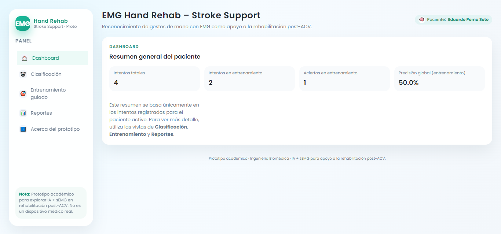
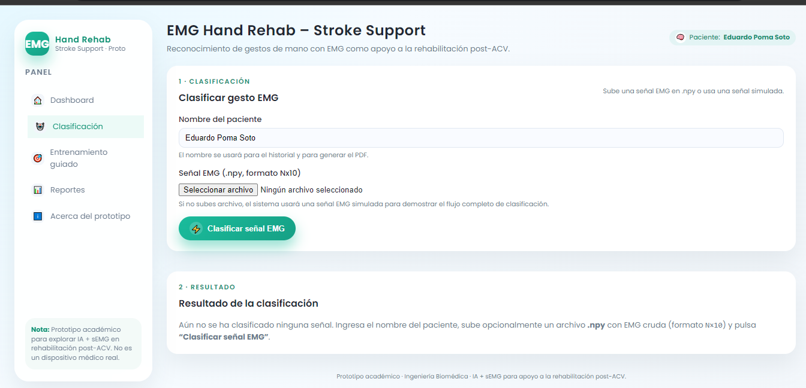
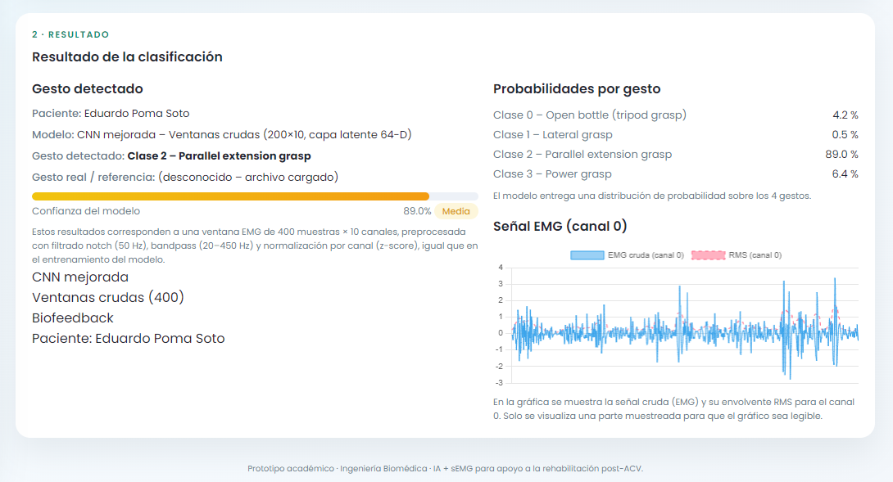
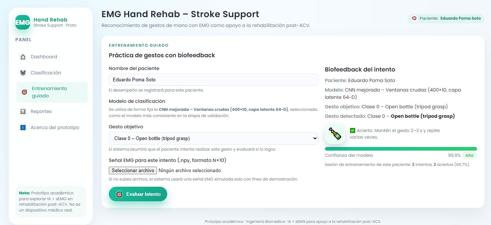
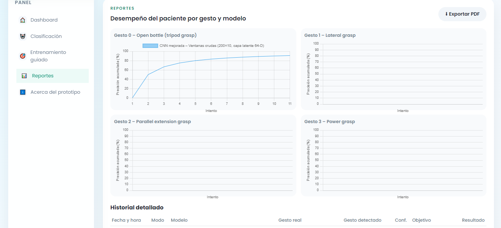
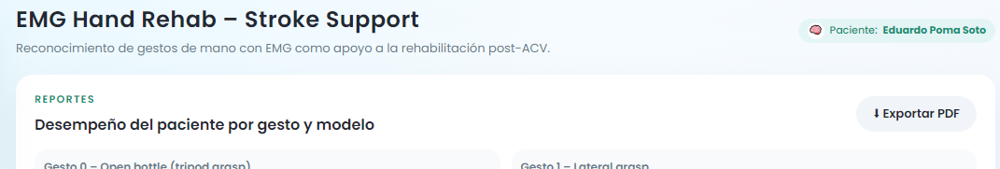
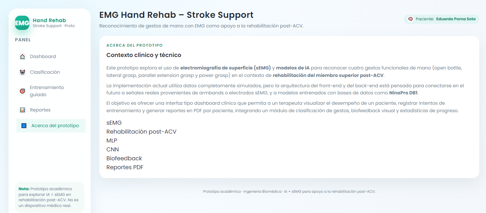

# 🖥️ EMG Hand Rehab – Interfaz Web para Clasificación y Entrenamiento de Gestos

## 🔗 Enlaces del prototipo

- 🎥 **Video demostrativo (Drive):**  
  _[https://drive.google.com/file/d/158CEFk53HA-zhElTgPDwDCWkQGWCYZdA/view?usp=drive_link]_

- 🌐 **Enlace al sistema en vivo (ngrok u otro):**  
  _[(https://furthermost-martyrly-tania.ngrok-free.dev)]_

---

## 📑 Tabla de contenidos

1. [Descripción general de la interfaz](#1-descripción-general-de-la-interfaz)  
2. [Tecnologías usadas en el front-end](#2-tecnologías-usadas-en-el-front-end)  
3. [Estructura común de todas las páginas](#3-estructura-común-de-todas-las-páginas)  
   - 3.1. [Barra lateral (sidebar)](#31-barra-lateral-sidebar)  
   - 3.2. [Encabezado superior](#32-encabezado-superior)  
4. [Módulo **Dashboard**](#4-módulo-dashboard)  
5. [Módulo **Clasificación**](#5-módulo-clasificación)  
   - 5.1. [Ingreso de paciente](#51-ingreso-de-paciente)  
   - 5.2. [Carga de archivo EMG](#52-carga-de-archivo-emg)  
   - 5.3. [Resultados de clasificación y gráficas](#53-resultados-de-clasificación-y-gráficas)  
6. [Módulo **Entrenamiento guiado**](#6-módulo-entrenamiento-guiado)  
   - 6.1. [Selección del gesto objetivo](#61-selección-del-gesto-objetivo)  
   - 6.2. [Biofeedback y resumen de sesión](#62-biofeedback-y-resumen-de-sesión)  
7. [Módulo **Reportes**](#7-módulo-reportes)  
   - 7.1. [Métricas globales](#71-métricas-globales)  
   - 7.2. [Gráficas por gesto](#72-gráficas-por-gesto)  
   - 7.3. [Historial detallado](#73-historial-detallado)  
   - 7.4. [Exportación a PDF](#74-exportación-a-pdf)  
8. [Módulo **Acerca del prototipo**](#8-módulo-acerca-del-prototipo)  
9. [Resumen rápido: qué se puede hacer en cada sección](#9-resumen-rápido-qué-se-puede-hacer-en-cada-sección)  

---

# 1. Descripción general de la interfaz

La interfaz web **EMG Hand Rehab – Stroke Support** es un prototipo de apoyo a la rehabilitación de mano mediante señales **sEMG** y un modelo de **clasificación de gestos** basado en una CNN.

Desde el punto de vista del usuario, la app permite:

- Registrar el nombre de un paciente.  
- Clasificar gestos de mano a partir de una señal EMG cargada.  
- Simular un **entrenamiento guiado de gestos**, recibiendo biofeedback de acierto/fallo.  
- Consultar un **historial detallado** de todos los intentos.  
- Visualizar **gráficas de desempeño por gesto**.  
- Exportar un **reporte PDF** con el resumen de la sesión.

> 🔎 Esta documentación se centra **solo en la interfaz y el flujo de uso**, no en los detalles internos del código.

---

# 2. Tecnologías usadas en el front-end

- **HTML + Jinja2**: para las plantillas de cada vista (`layout.html`, `classify.html`, `train.html`, `dashboard.html`, `reports.html`, `about.html`).  
- **CSS personalizado** (`static/style.css`): define el diseño tipo dashboard, colores, tarjetas, botones, etc.  
- **Chart.js**: para las gráficas de rendimiento en el módulo de **Reportes**.  
- **Flask**: se encarga de inyectar los datos (resultados, historial, nombre del paciente, etc.) en las plantillas.

---

# 3. Estructura común de todas las páginas

Todas las vistas comparten un mismo layout base (`layout.html`), que define:

- Una **barra lateral fija (sidebar)**.  
- Un área de **contenido principal** donde se carga cada sección.  
- Un **encabezado superior** con título y estado del paciente.

---

## 3.1. Barra lateral (sidebar)

En la **sidebar** se muestran:

- Un pequeño **logo** con el texto `EMG` y el subtítulo  
  > *Hand Rehab – Stroke Support · Proto*

- El menú de navegación con las secciones:
  - **Dashboard**
  - **Clasificación**
  - **Entrenamiento guiado**
  - **Reportes**
  - **Acerca del prototipo**

- Una nota final aclarando que se trata de un **prototipo académico**, no de un dispositivo médico real.

La sección activa se muestra resaltada (por CSS) para indicar en qué módulo se encuentra el usuario.

> 🖼️ **Figura 1. Vista general de la interfaz con la barra lateral y el área de contenido.**

---

## 3.2. Encabezado superior

En la parte superior del contenido principal se incluye:

- El título general:  
  **“EMG Hand Rehab – Stroke Support”**
- Un subtítulo explicando brevemente la finalidad (reconocimiento de gestos EMG para apoyo a rehabilitación post-ACV).  
- Una **“píldora” de estado** que muestra:
  - El nombre del paciente actual, si se ha registrado.  
  - El texto `Sin paciente activo` si aún no se ha ingresado un nombre.

> 🖼️ **Figura 2. Encabezado principal con título del sistema y nombre del paciente activo.**

---

# 4. Módulo **Dashboard**

El **Dashboard** es una vista de resumen global del desempeño del paciente actual.

En esta sección se muestran típicamente:

- **Total de intentos** realizados (clasificación + entrenamiento).  
- **Intentos de entrenamiento**.  
- **Número de aciertos** en entrenamiento.  
- **Precisión global de entrenamiento** (porcentaje de aciertos sobre intentos de entrenamiento).

Todo se presenta en forma de **tarjetas** (cards) con números grandes y texto pequeño explicando cada métrica.

Características importantes:

- El Dashboard es **solo lectura**: no se suben archivos ni se hacen acciones de clasificación.  
- Sirve para que el profesional vea rápidamente si el paciente mejora o no durante la sesión.

> 🖼️ **Figura 3. Módulo Dashboard con las tarjetas de resumen de desempeño.**

---

# 5. Módulo **Clasificación**

La sección de **Clasificación** está pensada como el modo de evaluación de gestos EMG sin objetivo explícito: el sistema simplemente indica qué gesto detecta el modelo a partir de la señal.

La vista se divide en dos columnas:

- Columna izquierda: formulario para paciente + carga de archivos.  
- Columna derecha: resultados de la clasificación y gráficas.

---

## 5.1. Ingreso de paciente

En el formulario de la izquierda se encuentra:

- **Campo “Nombre del paciente”**  
  - Permite ingresar o actualizar el paciente activo.  
  - Todos los intentos (clasificación y entrenamiento) se guardan **asociados a ese nombre**.

Si el usuario no escribe nada, el sistema maneja un nombre genérico como `"Paciente sin nombre"`, pero lo recomendable es ingresar el nombre para poder generar reportes específicos.

---

## 5.2. Carga de archivo EMG

Debajo del nombre del paciente se muestra la sección para **subir archivo**:

- El sistema acepta archivos **`.npy`** (matrices `N x 10` canales).  
- Si el usuario **no selecciona un archivo**, puede mantenerse un modo demo (señal EMG simulada).  
- Si el archivo es válido, se usa esa señal real para la clasificación.

Desde el punto de vista del usuario:

1. Escribe el nombre del paciente.  
2. Selecciona un archivo `.npy` con EMG.  
3. Presiona el botón de **clasificar**.

---

## 5.3. Resultados de clasificación y gráficas

En la columna derecha se muestran:

- **Gesto detectado** por el modelo, por ejemplo:  
  > *Open bottle (tripod grasp)*  
- **Confianza del modelo en porcentaje** (por ejemplo 97.5%).  
- Una etiqueta de nivel de confianza:  
  - **Alta**, **Media** o **Baja**, según el valor.  
- Una **lista de probabilidades** donde se indica, para cada gesto:
  - Índice de clase.  
  - Nombre de la clase.  
  - Probabilidad en %.

Además, se incluye una **gráfica de la señal EMG**:

- Señal cruda de un canal (por ejemplo, canal 1).  
- Envolvente o RMS suavizada para apreciar mejor la activación muscular.

También:

- Cada vez que se presiona “Clasificar”, se registra un intento en el historial con:
  - `mode = classify`  
  - nombre del paciente  
  - gesto detectado  
  - nivel de confianza  
  - timestamp (fecha y hora)

> 🖼️ **Figura 4. Módulo Clasificación con formulario, gesto detectado y gráfica EMG + RMS.**

> 🔹 En **Clasificación** no se habla de “acierto” o “fallo”, porque no se define un gesto objetivo. Solo se predice qué gesto ve el modelo.

---

# 6. Módulo **Entrenamiento guiado**

La sección de **Entrenamiento guiado** simula una sesión en la que el paciente **intenta realizar un gesto concreto** (por ejemplo, *Power grasp*), y la interfaz responde con un biofeedback de **Acierto / Fallo**.

También está organizada en dos columnas:

- Columna izquierda: formulario.  
- Columna derecha: biofeedback y métricas de la sesión.

---

## 6.1. Selección del gesto objetivo

En el formulario de la izquierda se encuentran:

- Campo **“Nombre del paciente”** (igual que en Clasificación).  
- Un texto que describe el **modelo de clasificación**:
  - Se explica que se usa una **CNN mejorada** con ventanas crudas de EMG.  
  - El modelo está fijado desde el back-end; el usuario no lo cambia.
- Desplegable **“Gesto objetivo”** con las clases:
  - Clase 0 – Open bottle (tripod grasp)  
  - Clase 1 – Lateral grasp  
  - Clase 2 – Parallel extension grasp  
  - Clase 3 – Power grasp  

Flujo de uso:

1. Ingresar (o confirmar) el nombre del paciente.  
2. Elegir un **gesto objetivo** en el desplegable.  
3. Presionar el botón **“Evaluar intento”**.

El sistema procesa una señal asociada a ese intento y la pasa al modelo.

---

## 6.2. Biofeedback y resumen de sesión

En la parte derecha se muestra el bloque de **“Biofeedback del intento”**, que incluye:

- Paciente activo.  
- Modelo utilizado (texto fijo).  
- **Gesto objetivo** seleccionado.  
- **Gesto detectado** por el modelo.

Luego, se presentan elementos visuales:

- Un **icono de mano / emoji** que cambia según el gesto detectado.  
- Un texto de **feedback**:
  - ✅ Si el gesto detectado coincide con el objetivo:  
    > “Acierto. Mantén el gesto 2–3 s y repite varias veces.”
  - ❌ Si no coincide:  
    > “No coincide. Ajusta la postura de dedos y antebrazo.”

También aparece una **barra de confianza**:

- Una barra horizontal que se llena proporcionalmente al porcentaje de confianza.  
- Una etiqueta indicando:
  - Valor numérico (por ejemplo `95.3%`).  
  - Badge con texto “Alta / Media / Baja”.

Finalmente, el sistema muestra un **resumen de la sesión de entrenamiento**:

- Intentos totales de entrenamiento (solo `mode = train`).  
- Aciertos en entrenamiento.  
- **Porcentaje de acierto** de la sesión.

Cada intento de entrenamiento se guarda en el historial con:

- `mode = "train"`  
- Gesto objetivo (`target_gesture`).  
- Gesto detectado (`gesture_idx`).  
- `match_target = True/False`.  
- `confidence_pct`.  
- timestamp y paciente.

> 🖼️ **Figura 5. Módulo Entrenamiento guiado con gesto objetivo, gesto detectado, biofeedback y barra de confianza.**

---

# 7. Módulo **Reportes**

El módulo de **Reportes** es la vista donde se concentra toda la información histórica del paciente activo: métricas generales, gráficos por gesto y tabla de historial.

---

## 7.1. Métricas globales

En la parte superior se muestran tarjetas con:

- **Intentos totales** (clasificación + entrenamiento).  
- **Intentos de entrenamiento**.  
- **Aciertos en entrenamiento**.  
- **Precisión global de entrenamiento** (%).

Estas métricas se basan en el historial acumulado para el paciente actual.

---

## 7.2. Gráficas por gesto

Debajo de las tarjetas aparece un bloque de tarjetas de reporte, una por cada gesto:

- Open bottle (tripod grasp)  
- Lateral grasp  
- Parallel extension grasp  
- Power grasp  

Cada tarjeta incluye un **gráfico de línea** generado con **Chart.js**, donde:

- El eje X representa el **número de intento** de entrenamiento para ese gesto (1, 2, 3, …).  
- El eje Y muestra la **precisión acumulada** del gesto (0–100%).

Interpretación:

- Si el paciente mejora en un gesto, la curva tiende a subir.  
- Si hay muchos fallos, la curva se estabiliza o baja.

> 🖼️ **Figura 6. Gráficas de precisión acumulada por gesto en el módulo de Reportes.**

---

## 7.3. Historial detallado

Más abajo se incluye una **tabla de historial** con todas las interacciones del paciente:

Columnas típicas:

- **Fecha y hora** del intento.  
- **Modo** (`classify` o `train`).  
- **Modelo** (nombre descriptivo).  
- **Gesto real**:
  - En entrenamiento: el gesto objetivo.  
  - En clasificación con archivo cargado: puede aparecer como “(desconocido – archivo cargado)”.  
- **Gesto detectado** por el modelo.  
- **Conf.**: confianza en porcentaje.  
- **Objetivo**:
  - Nombre del gesto objetivo (solo en entrenamiento).  
  - `–` en clasificación.  
- **Resultado**:
  - `✅ Acierto` si `match_target` es `True`.  
  - `❌ Fallo` si `match_target` es `False`.  
  - `–` en clasificación.

> 🖼️ **Figura 7. Tabla de historial detallado con intentos de clasificación y entrenamiento.**

---

## 7.4. Exportación a PDF

En la parte superior derecha del módulo de Reportes hay un botón:

> **⬇ Exportar PDF**

Comportamiento:

- Solo tiene sentido si hay un **paciente activo** con historial.  
- Al hacer clic, se genera un **PDF** que incluye:
  - Nombre del paciente.  
  - Fecha de generación del reporte.  
  - Intentos totales.  
  - Intentos de entrenamiento.  
  - Aciertos de entrenamiento.  
  - Un listado línea por línea del historial (modo, gesto detectado, confianza, objetivo y resultado).

⚠️ **Limitación actual:**  
El PDF exportado **no incluye las gráficas** del dashboard o de Chart.js; solo contiene texto y números.

> 🖼️ **Figura 8. Botón de exportación a PDF en el módulo de Reportes.**

---

# 8. Módulo **Acerca del prototipo**

La sección **Acerca del prototipo** cumple una función informativa. Allí se explica:

- Que se trata de un **proyecto académico** de ingeniería biomédica.  
- Que el objetivo es explorar el uso de **IA + señales EMG** para apoyar la rehabilitación post-ACV.  
- Que **no es un dispositivo médico** ni debe usarse para decisiones clínicas reales.  

No se muestran métricas ni se guardan datos desde esta vista.

> 🖼️ **Figura 9. Página “Acerca del prototipo” con la descripción del proyecto.**

---

# 9. Resumen rápido: qué se puede hacer en cada sección

| Sección                 | Qué ve el usuario                                   | Qué puede hacer                                      | ¿Se guarda historial? |
|-------------------------|-----------------------------------------------------|------------------------------------------------------|------------------------|
| **Dashboard**           | Resumen global (intentos, aciertos, precisión)     | Solo visualizar estadísticas                         | ✅ Usa historial previo |
| **Clasificación**       | Formulario + gesto detectado + gráfica EMG         | Ingresar paciente, subir `.npy`, clasificar señal    | ✅ Registra intentos    |
| **Entrenamiento guiado**| Gesto objetivo, gesto detectado, biofeedback       | Ingresar paciente, elegir gesto, evaluar intento     | ✅ Registra intentos    |
| **Reportes**            | Gráficas por gesto + tabla de historial + botón PDF| Revisar desempeño, exportar reporte en PDF           | ✅ Usa historial previo |
| **Acerca del prototipo**| Texto descriptivo del proyecto                      | Solo leer información                                | ❌                      |

